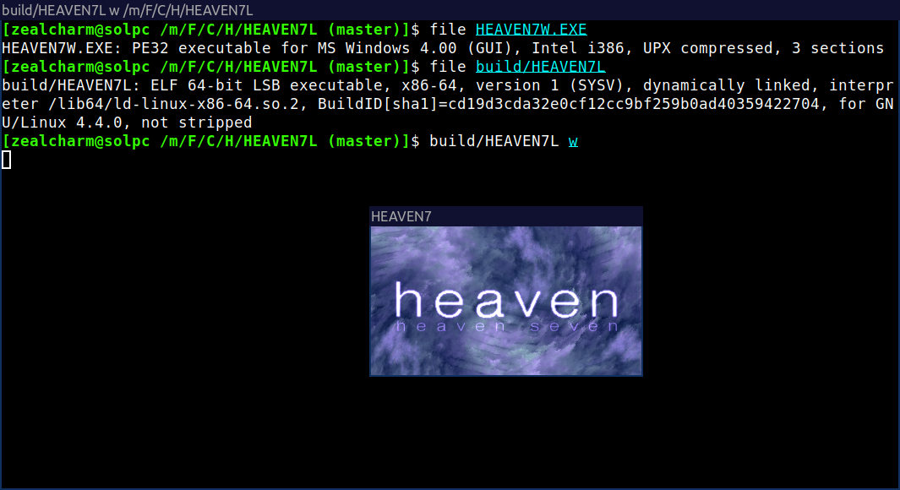

HEAVEN7L
========
A program to run the "[heaven seven](https://www.pouet.net/prod.php?which=5)" 64k demo by Exceed on Linux (or other platforms) via SDL.



This works similarly to [Wine](https://www.winehq.org/): It runs the original executable and implements a translator from Win32/DirectDraw/DirectAudio/etc. API calls to SDL.

Why? Wine already exists!
-------------------------
This is just a project for the heck of it.

Quickstart
----------
You will need:
* A x86_64 computer
* Basic build tools (GCC, make, etc.), with 32-bit support
* CMake
* curl
* unzip
* SDL2 (32-bit version)

In Debian, you can use the following commands:
```sh
sudo dpkg --add-architecture i386
sudo apt update
sudo apt install build-essential cmake curl unzip gcc-multilib libsdl2-dev:i386
```

Then, build HEAVEN7L, download the "heaven seven" demo, and run it as follows:
```sh
cmake -B build && cmake --build build
./download_HEAVEN7W.sh
build/HEAVEN7L
```
